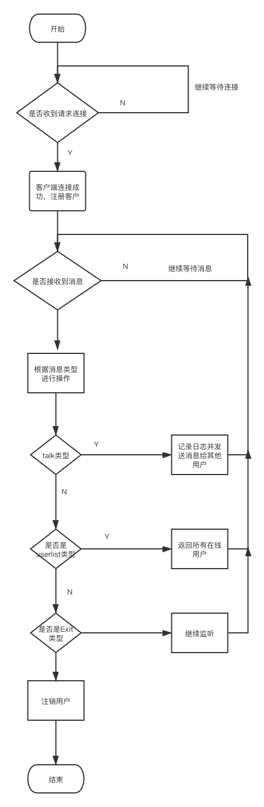

# Websocket-chat

# Go技术文档-聊天服务

## 1.整体框架

开发一个在线聊天服务，聊天协议websocket，通信数据格式protobuf。

主要功能包括：

1） 接受客户端发起的连接请求，建立ws连接（header中带username），支持ping/pong心跳

2） 维护管理多用户的ws连接

3） 收到talk类型消息，记录日志，把收到消息转发给所有连接的用户

4） 收到exit类型消息，断开连接，清理用户信息

5） 收到userlist消息，返回所有在线用户username

## 2.目录结构

```
.
├── Protobuf
│   ├── connect.pb.go
│   └── connect.proto
├── README.md
├── db
│   └── userDB.go #用户存储操作
├── go.mod
├── go.sum
├── log #日志层
│   └── result.log
├── main.go
├── router
│   └── router.go
├── server
│   ├── client.go
│   ├── handleWS.go
│   └── hub.go
├── test
│   ├── __pycache__
│   │   ├── connect_pb2.cpython-39.pyc
│   │   └── locust_test.cpython-39.pyc
│   ├── connect_pb2.py
│   ├── locust_test.py
│   └── report.html
├── view
│   ├── connect.proto
│   └── home.html
└── websocket.png #流程图


```


## 3.代码逻辑分层

​	

| 层         | 文件夹    | 主要职责               | 调用关系     | 其他说明 |
| ---------- | --------- | ---------------------- | ------------ | -------- |
| 应用层     | /main.go  | 程序启动               | 调用路由层   |          |
| log层      | /log      | 存放用户的交互信息日志 | 被服务层调用 |          |
| service层  | /service/ | 初始实例化客户         | 路由层       |          |
| 路由层     | /router   | 路由初始化             | 被应用层调用 |          |
| protobuf层 | /protobuf | 消息传送格式           | server层调用 |          |
| Db层       | /db       | 用户相关操作           |              |          |
| view层     | /view     | 存放前端聊天页面窗口   |              |          |


## 4.存储设计

数据存储信息

```
syntax = "proto3";
package com;

option go_package="../Protobuf;Protobuf";

message Communication{
  string Type = 1;
  string Msg = 2 ;
  string  Username=3;
  repeated string Userlist=4;
  string  IP =5;
}

```

```
用户名临时存储
type User struct {
	UserName string
}
```


## 5.接口设计

### 1.用户登录

### 	请求方式

​		websocket

### 	接口地址

​		ws:请求地质 ws://localhost:8080//ws

1. talk类型

   ```
   {
   	Type = "1";
     Msg： "来啦来啦" ;
     Username：“117835e871-8444-47f1-bd73-70e9350f68e7”;
     Userlist=““;
     string  IP =“”;
   }
   ```

2. Exit类型

   ```
   {
   	 Type = "2";
      Msg："" ;
      Username：“117835e871-8444-47f1-bd73-70e9350f68e7”;
      Userlist=“”;
      string  IP =“”;
   }
   ```

3. Userlist类型

   ```
   {
   	 Type = "1";
      Msg："" ;
      Username：“117835e871-8444-47f1-bd73-70e9350f68e7”;
      Userlist=“117835e871-8444-47f1-bd73-70e9350f68e7”;
      string  IP =“”;
   }
   ```

   ### 

## 6.第三方库

```
gorilla/websocket Go语言版websocket实现

```

## 7.如何编译执行

### 代码格式化

```
make fmt
```

### 代码静态检测

```
make vet
```




